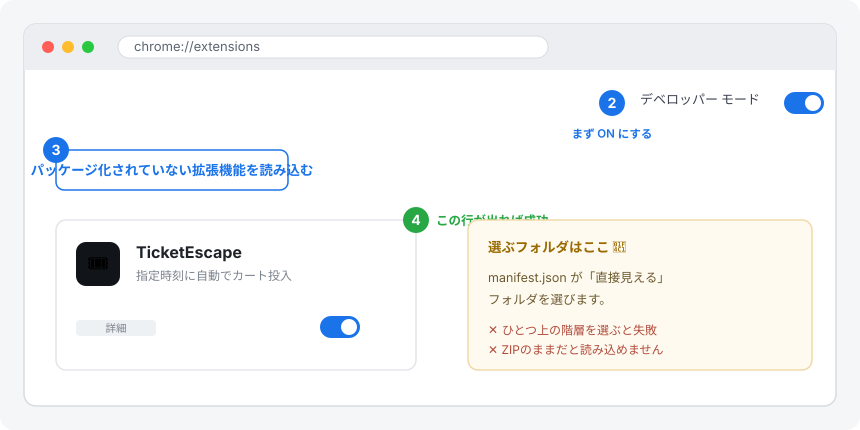
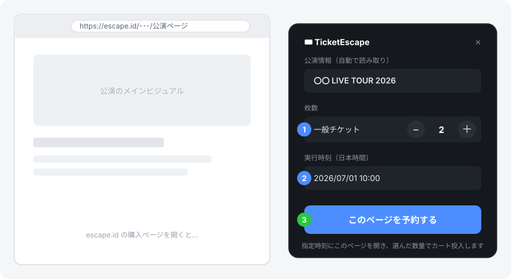
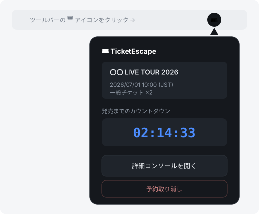

# TicketEscape

`TicketEscape` は、`https://escape.id/*` の購入ページを **指定した時刻にあなたの代わりに自動操作する** Chrome 拡張です。
発売の瞬間に、券種ごとの枚数を選んで「カートに入れる」までを自動で行います。

> API を使うのではなく、**実際のページにあるボタンやチェックボックスを自動でクリック**して動きます。
> そのため、事前に `escape.id` へログインしておく必要があります。

---

## 📖 このREADMEについて

パソコンやChrome拡張に詳しくない方でも、**上から順番に読むだけで使えること** を目標にしています。

- Chrome拡張を手で入れたことがない
- GitHubからのダウンロードに慣れていない
- 「とにかく失敗しない手順」を知りたい

そんな方向けに、**入れる → 設定する → 当日使う** までを1本で説明します。
困ったときは「[❓ こんなときどうする](#-こんなときどうする)」を見てください。

---

## 🎯 まず全体像（3ステップ）

難しく考えなくて大丈夫です。やることはこの3つだけです。

| | やること | どこで |
|---|---|---|
| **① 入れる** | この拡張をChromeに読み込む（1回だけ） | `chrome://extensions/` |
| **② 予約する** | 公演ページを開いて、枚数と時刻を決める | escape.id のページ上 |
| **③ 待つ** | 時間になると自動でカート投入される | パソコンを開いたまま待つだけ |

---

## ⚠️ 始める前に知っておくこと

- この拡張は **Chrome ウェブストア版ではありません**。GitHubからダウンロードして自分で読み込みます。
- 動くのは `https://escape.id/*` のページ **だけ** です。
- 実行する前に、**必ず同じChromeで `escape.id` にログイン**しておいてください。
- 公演ページのHTMLが変わると、一時的に動かなくなることがあります。
- **チケットが必ず取れることを保証するものではありません**（最後の「免責」も読んでください）。

---

## 💻 動作環境

- Google Chrome（最新版を推奨）
- macOS / Windows
- このプロジェクトのフォルダ一式（`manifest.json` を含むもの）

---

## 1️⃣ インストール手順

### STEP 1. ファイルをダウンロードする

#### 方法A：ZIPでダウンロード（初心者におすすめ）

1. GitHubのリポジトリページを開く
2. 緑色の **`Code`** ボタンをクリック
3. **`Download ZIP`** をクリック
4. ダウンロードしたZIPファイルを **解凍（展開）** する
5. 解凍してできたフォルダの中に **`manifest.json` があること** を確認する

> 💡 **ここでつまずきやすい！**
> - ZIPのままでは読み込めません。**必ず解凍**してください。
> - フォルダが二重（例：`TicketEscape/TicketEscape/...`）になっていることがあります。
>   **`manifest.json` が直接見えるフォルダ**を覚えておいてください。次の手順で選びます。

#### 方法B：Gitコマンドで取得（慣れている方向け）

```bash
git clone https://github.com/FukaseDaichi/TicketEscape.git
cd TicketEscape
```

### STEP 2. Chromeに読み込む



1. Chromeのアドレスバーに `chrome://extensions/` と入力して開く
2. 右上の **`デベロッパー モード`** を **ON** にする
3. 左上に出てくる **`パッケージ化されていない拡張機能を読み込む`** をクリック
4. STEP 1 で確認した **`manifest.json` があるフォルダ** を選ぶ
5. 一覧に **`TicketEscape`** のカードが出れば成功です 🎉

> 💡 **フォルダ選択のコツ**：`manifest.json` を選ぶのではなく、`manifest.json` が **入っているフォルダ** を選びます。
> ひとつ上の階層を選ぶと「マニフェストが見つからない」と失敗します。

これで準備は完了です。アイコンが薄く表示される場合は、ツールバーのパズル型アイコン（🧩）から TicketEscape を **ピン留め** しておくと便利です。

---

## 2️⃣ 予約のしかた（いちばん簡単な方法）

予約の入口は3つありますが、**いちばん簡単なのは「ページ内パネル」**です。
**escape.id の公演ページを開くだけ** で、画面の右側にパネルが自動で出てきます。



1. `escape.id` に **ログイン** した状態で、買いたい **公演の購入ページを開く**
2. 右側に出る TicketEscape パネルで、**`＋` `−` を押して欲しい枚数** にする（不要な券種は `0` のまま）
3. **実行時刻（日本時間）** を入力する … チケットの発売時刻に合わせます
4. **`このページを予約する`** を押す

これだけで予約完了です。あとは時間になるのを待つだけ。

> 💡 公演名や枚数は、ページから **自動で読み取られて** パネルに表示されます。
> 表示がおかしいときは、パネルの再読み込み（読み取り）を試してください。

> ⚠️ **アクティブな予約は常に1件だけ**です。別の公演を予約すると、前の予約は上書きされます（確認メッセージが出ます）。

---

## 3️⃣ 予約を確認する（ポップアップ）

ツールバーの **🎟️ アイコン** をクリックすると、今の予約をひと目で確認できます。



ポップアップで見られること・できること：

- 公演名 / メインビジュアル / 対象URL
- 実行時刻（JST）と **発売までのカウントダウン**
- 購入予定の券種と枚数
- **予約の取り消し**
- **詳細コンソール（オプション画面）を開く** ボタン

> ℹ️ ポップアップは「確認専用」です。**枚数や時刻の変更・新規予約はできません**。
> 変更したいときは、ページ内パネルか、次の「詳細コンソール」から行います。

---

## 4️⃣ 詳細コンソール（オプション画面）

細かく設定したい・実行履歴を見たいときは、オプション画面（詳細コンソール）を使います。

**開き方**（どちらでもOK）：

- ポップアップの **`詳細コンソールを開く`** を押す
- `chrome://extensions/` → `TicketEscape` → `詳細` → **`拡張機能のオプション`**

### 基本の流れ

1. **`予約対象ページ`** に公演ページのURLを入れる
2. **`実行時刻を設定（JST）`** に発売時刻を入れる（秒は自動で `00`）
3. **`フォームに読み込む`** を押す → 券種が読み込まれる
4. **券種ごとの数量** を `＋` `−` で設定する
5. **`予約`** を押す → カウントダウンが始まる

> ⚠️ このオプション画面のタブは、当日まで **開いたままにしておく** と確実です（時刻になるとこのタブが対象URLへ移動します）。

### 詳細設定（ふつうは触らなくてOK）

| 項目 | 初期値 | 意味 |
|---|---|---|
| `クリック間隔 (ms)` | `30` | ボタンを連打する間隔。基本そのままで大丈夫です。 |
| `並列実行数` | `1` | 同時に使うタブ数（`1`〜`5`）。増やすほど成功率が上がる可能性がありますが、負荷も上がります。 |
| `チェックボックス自動ON` | ON | フォーム内の同意チェックなどを自動でONにします。 |
| `選択リスト自動選択` | ON | 必須の選択リストがあれば、先頭の選択肢を自動で選びます。 |

---

## 5️⃣ 当日の使い方（失敗を減らすコツ）

### 開始 10〜15分前にやること

1. `escape.id` に **ログイン済み** か確認する
2. 対象の公演ページが **表示できる** か確認する
3. 予約した **URL・時刻・枚数** をもう一度確認する
4. **カウントダウンが動いている** ことを確認する

### 直前にやってはいけないこと

- ❌ パソコンを **スリープ** させる（電源設定でスリープOFFを推奨）
- ❌ **ネットワーク（Wi-Fi等）を切る**
- ❌ 予約に使っている **タブを閉じる**
- ❌ 重いアプリでパソコンを **重くする**

### 時間になると何が起こる？

- `0秒` になると、予約に使っていたタブが対象URLへ移動します
- 同時にバックグラウンドで自動処理が始まります
- 設定した並列数のぶんだけタブを使って、各タブで「枚数調整 → チェック → カート投入」が走ります

---

## 🔄 アップデート方法（新しいバージョンに更新する）

新しい版が出たら、次の手順で入れ替えます。

### ZIPで入れた場合

1. **新しいZIP** をダウンロードして解凍する
2. 古いフォルダを、新しいフォルダで **置き換える**（同じ場所に上書き）
   - ※フォルダの場所を変えると、Chrome側で読み込み直しが必要になります
3. `chrome://extensions/` を開く
4. `TicketEscape` カードの **🔄 更新（再読み込み）アイコン** を押す
5. それでも反映されないときは、一度 **`削除`** して、もう一度 **「STEP 2. Chromeに読み込む」** をやり直す

### Gitで入れた場合

```bash
cd TicketEscape   # 取得したフォルダへ移動
git pull          # 最新を取得
```

そのあと `chrome://extensions/` で **🔄 更新アイコン** を押せば反映されます。

> 💡 **更新したら必ず確認**：アップデート後はカウントダウンや券種読み取りが正しく動くか、本番前に一度テストしてください。

---

## ❓ こんなときどうする

### Q. 拡張が読み込めない / カードが出てこない
- `manifest.json` の **ない** フォルダを選んでいませんか？ → `manifest.json` が見えるフォルダを選び直す
- ZIPを **解凍していない** → 解凍してから読み込む
- **デベロッパー モードがOFF** → `chrome://extensions/` 右上でONにする

### Q. ページにパネルが出てこない
- そのページが `https://escape.id/...` か確認する（対象サイト以外では出ません）
- ページの読み込みが終わるまで数秒待つ
- ページを **再読み込み（F5）** する

### Q. 「フォームに読み込む」や読み取りが失敗する
- URLが `https://escape.id/*` の **購入ページ** か確認する
- **ログインしているか** 確認する（同じChromeプロファイルで）
- ページがまだ読み込み中 → 数秒待ってもう一度試す

### Q. 時間になっても実行されない / 遅れた
- 実行時刻が **過去** になっていませんか？ → 時刻を入れ直して **予約し直す**
- 設定を変えただけで **予約し直していない** → 変更後は必ずもう一度 `予約`
- パソコンが **スリープ** していた → 本番前はスリープを無効にする
- 予約に使っていた **タブを閉じてしまった** → 開き直して予約状態を確認する

### Q. 取れる枚数が思っていたのと違う
- 券種名が少し違うことがあります → もう一度 `フォームに読み込む`（パネルなら再読み取り）して、最新の券種名で設定する
- 不要な券種は **数量0** にする（またはゴミ箱で削除）

### Q. 予約を取り消したい
- ポップアップ、ページ内パネル、詳細コンソールの **どこからでも** `予約取り消し` で消せます。

---

## 🗑️ アンインストール

1. `chrome://extensions/` を開く
2. `TicketEscape` の **`削除`** を押す

---

## ⚖️ 免責と注意

- 本拡張は **非公式ツール** です。
- 利用は **自己責任** で行ってください。
- 対象サイトの **利用規約に反しない範囲** で使用してください。
- **チケット購入の成功を保証するものではありません**。

---

## 🛠️ 開発者向け情報

- アーキテクチャ・モジュール構成・実行フロー：[CLAUDE.md](CLAUDE.md)
- UIデザインシステム：[DESIGN.md](DESIGN.md)
- 予約の3入口と共通基盤：[docs/reservation-entry-points.md](docs/reservation-entry-points.md)

ビルド不要のバニラJavaScript（Manifest V3）です。`chrome://extensions/` で「パッケージ化されていない拡張機能を読み込む」で読み込み、コード変更後はカードの更新アイコンを押してください。
