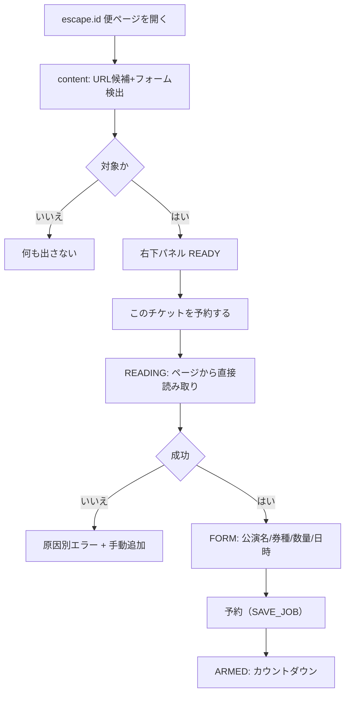

# パターン1: ページ内予約パネル（設計書）

> 共通基盤は [reservation-entry-points-overview.md](reservation-entry-points-overview.md) を参照。検知・起動パネルの先行設計は [ticket-page-entry-ux-design.md](ticket-page-entry-ux-design.md) を継承・拡張する。
>
> **方針更新**: 表示ゲート（escape.id 配下なら常時表示）と状態機械（ARMED / OTHER_RESERVED / READY / LAUNCHER）の最新仕様は [3-pattern-sync-redesign-design.md](3-pattern-sync-redesign-design.md)（§6）が正。副ボタンの表記は「詳細コンソールで開く」に統一。

## 1. 目的

`escape.id` のチケット便ページを開いた**そのページ上**で、設定画面へ移動せずに予約まで完結できる体験。「このチケットを予約する」ボタンを起点に、確認（読み取り）→券種反映→数量変更→日時入力→予約（実行待機）をページ内パネルだけで行う。

先行 doc との差分: 先行 doc は「起動パネル → オプション画面を開く」（ランチャー）だった。本パターンは**パネル自体に予約フォームを内蔵**し、ページ内で完結させる（オプションを開く導線は「詳細はこちら」として残す）。

## 2. 起点と表示ゲート

パネルは **escape.id 配下なら常時表示** する（`ensureEscapeUrl(location.href)`）。表示後、状況に応じて内容を自動で切り替える（§4）。

```
表示ゲート: protocol https / hostname escape.id（= どのページでも生成）
予約フロー(READY): さらに URLパラメータあり（isReservableTicketUrl）
```

`https://escape.id/uzu-org/e-MIRAGE/` のようにURLパラメータがないページでは「予約」フローは出さず、予約があれば予約サマリ（カウントダウン＋取り消し）、無ければ小さなランチャーバッジを出す。券種の読み取りはURLパラメータ付きの購入ページでのみ行う。

## 3. スコープ（このパネルでできること）

1. このページを予約対象にする（起動）
2. **読み取り（確認）** — ページから公演名・券種・現在数量を取得（＝今の `確認` 動作と同等。ページ上なので新規タブ不要）
3. **券種の反映** — 取得した券種をパネル内に一覧表示
4. **数量変更** — 各券種を `− 数 ＋` ステッパーで調整
5. **日時入力** — 実行時刻（JST）を入力し、ユーザーが確認する
6. **予約（実行待機）** — `SAVE_JOB` で登録し、当日 trigger に自動実行

読み取り時に公演のメインビジュアル画像URL（`div[class^="first"] img` → og:image → 最大画像 の順）も取得し、`heroImageUrl`（https のみ）として job に保存する。ポップアップ等のビジュアル表示に使う（[3-pattern-sync-redesign-design.md](3-pattern-sync-redesign-design.md) §5）。

このパネルでは履歴・詳細設定（クリック間隔・並列数等）は**出さない**。ただし固定の初期値ではなく、`te_preferences_v1` の既定値を使用する。詳細は「詳細設定を開く」でパターン3へ。

## 4. パネルの状態モデル

ページ右下に固定の小パネル（モバイル幅では下部固定）。共有 `buildReservationView(job, status)` と現在URL・フォーム検出から状態を導出する。

| 状態 | 条件 | 主な表示 | 主ボタン |
| --- | --- | --- | --- |
| `ARMED` | 予約あり & job.url ≈ このページ | STANDBY＋カウントダウン＋公演名＋券種 | 予約取り消し／詳細コンソールで開く |
| `OTHER_RESERVED` | 予約あり & 別URL & このページが購入フォーム有 | 「別の公演を予約中」＋カウントダウン | このページを予約する／予約取り消し／詳細コンソールで開く |
| `OTHER_RESERVED_VIEW` | 予約あり & 別URL & フォーム無し | 「別の公演を予約中」＋カウントダウン | 予約取り消し／詳細コンソールで開く |
| `READY` | 未予約 & 購入フォーム有（URLパラメータ） | 「このページを予約できます」 | **このチケットを予約する**／詳細コンソールで開く |
| `READING` | 読み取り実行中 | 進行表示 | （無効） |
| `FORM` | 読み取り成功 | 公演名＋券種ステッパー＋日時入力 | **予約**／詳細コンソールで開く |
| `READ_FAILED` | 取得失敗 | 原因別エラー | 再読み取り／詳細コンソールで開く |
| `LAUNCHER` | 未予約 & フォーム無し（トップ/一覧等） | 小さな「TicketEscape」バッジ | （クリックで詳細コンソール） |
| `DISMISSED` | ユーザーが閉じた | 小バッジのみ（タブ単位） | 再表示 |

`READY`→「このチケットを予約する」→`READING`→成功で `FORM` に展開→数量・時刻を整え「予約」で `ARMED`。`OTHER_RESERVED` の「このページを予約する」は読み取り後、保存時に切替確認（`replaceConfirmed`/`expectedPreviousJobId`）。`READING`/`FORM`/`SAVING` などの編集中状態は、背景の `storage.onChanged` では破棄しない。

## 5. パネルの画面構成（FORM 展開時）

```
┌─ TicketEscape ───────────────── [×] ┐
│ ● 予約できます                       │
│ 指定時刻に選んだ数量でカート投入します │
│ 公演: {eventTitle}                   │
│ ─────────────────────────────────── │
│ 券種                                 │
│  一般チケット      [−]  2  [＋]      │
│  学生チケット      [−]  0  [＋]      │
│  [＋ 券種を手動で追加]               │
│ ─────────────────────────────────── │
│ 実行時刻(JST)  [2026/06/27 22:00:00] │
│ ─────────────────────────────────── │
│      [      予約      ]   │  ← amber 実体
│  数量0/時刻未確認なら disabled        │
│  詳細設定/履歴を見る → 詳細コンソールで開く │
└──────────────────────────────────────┘
```

- 数量はページ上の現在数量を初期反映。全0なら全0のまま、予約ボタンは disabled にして「予約するには、1枚以上の数量を設定してください」と表示する（勝手に1にしない）。
- 実行時刻は datetime-local。初期値は「現在＋10分」など安全側の仮入力にできるが、ユーザーが入力欄を確認/変更するまで予約ボタンは disabled にする。
- 別URLの予約が実行待機中の場合は、確認なしで上書きしない。`SAVE_JOB` 送信時も `replaceConfirmed` / `expectedPreviousJobId` を付ける。

## 6. 実装設計

### 注入方式（サイトCSS干渉の回避）
- content script が `document.body` に**ホスト要素＋ Shadow DOM** を生成し、その中にパネルUIを描画する。サイト側CSSと相互に干渉しない。
- Shadow root 内に CONSOLE トークン（`--te-*`）を `:host` で定義（`styles/tokens.css` の値をインライン複製、または共通定数を `lib` から供給）。絵文字禁止・単線SVG。
- `z-index` は高くするが、**購入フォームのボタン・数量UIを覆わない**。右下固定＋閉じるボタン。`prefers-reduced-motion` でパルス停止。

### 読み取り（確認）
- パネルは content script 内の既存 `handleParseFormRequest()` を**そのまま直接呼ぶ**（同一コンテキスト＝メッセージ往復不要・新規タブ不要）。これが「今の確認動作と同じ感じ」の中身。
- 取得した `tickets`（label/currentQty/priceText）と `eventTitle` をパネルへ反映。

### 予約（実行待機）
- パネルは job を組み立て、`SAVE_JOB` を SW へ送る。

```js
job = {
  targetUrl: location.href,          // SW 側 ensureEscapeUrl で正規化・検証
  triggerAtJst,                      // 日時入力 → JST ISO
  eventTitle,
  heroImageUrl,                      // 読み取り時に取得（https のみ）
  ticketPlans,                       // パネルの数量
  clickIntervalMs: preferences.clickIntervalMs,
  parallelTabCount: preferences.parallelTabCount,
  requireAgreement: preferences.requireAgreement
}
```

- SW は既存 `handleSaveJob()` で sanitize＋alarm 作成。成功で `ARMED` に遷移しカウントダウン表示。
- 予約後の trigger 実行: 既存 `dispatchExecution()` が対象URLのタブを再利用（このページが該当）。ロジック変更なし。
- `clickIntervalMs` / `parallelTabCount` / `requireAgreement` は `te_preferences_v1` を使う。preferences がなければ `DEFAULT_JOB`。

### 既存ジョブとの整合
- 起動時に `GET_JOB`/`GET_STATUS` を取得。
  - 同URL → `SAME_JOB`（待機中表示）。
  - 別URL → `OTHER_JOB`。「このページに切り替える」で確認の上 `SAVE_JOB` 上書き（無確認上書きはしない）。SW側でも確認フラグなしの上書きを拒否する。

### 「詳細を開く」導線
- パネルの副ボタンで `OPEN_OPTIONS_WITH_PAGE`（ドラフト保存＋オプションを開く）。パターン3へ自然に接続。

## 7. ユーザーフロー



## 8. エラー・エッジ

| ケース | 表示 |
| --- | --- |
| フォーム未検出 | チケットフォームが見つかりません。購入ページを開いてから再試行してください。 |
| 券種が空 | フォームは見つかりましたが券種を読み取れませんでした。読み込み後に再試行してください。 |
| 未ログインの疑い | 読み取れません。escape.id にログイン後に再試行してください。 |
| DOM変更の可能性 | サイト構造が変わった可能性があります。手動で券種を追加してください。 |
| 予約時刻が過去 | 実行時刻が過去です。時刻を設定し直してください。 |

失敗時も URL・入力は消さず、手動で券種追加できる逃げ道を残す。

## 9. アクセシビリティ

- パネルは `role="region"` / `aria-label="TicketEscape"`。自動表示でフォーカスを奪わない。
- 主ボタンは Tab で到達可能。閉じるボタン必須。読み取り中 `aria-busy="true"`、結果は `aria-live="polite"`。
- 状態は色だけに依存しない（ラベル＋アイコン）。

## 10. 受け入れ条件

1. escape.id 配下のどのページでも右下にパネルが出る（予約あり→サマリ＋カウントダウン、購入フォーム有→予約フロー、どちらも無し→ランチャーバッジ）。
2. 「このチケットを予約する」→ ページから公演名・券種・現在数量が反映される。
3. パネル内で数量（ステッパー）と実行時刻を設定できる。
4. 数量が1枚以上あり、実行時刻が確認済みの場合のみ「予約」できる。
5. 「予約」で `te_job_v1` が保存され alarm が作成、`ARMED`＋カウントダウンになる。
6. 別URLの予約を置き換える場合、明示確認なしでは保存できない。
7. 詳細設定は `te_preferences_v1` の値を使う。
8. 同URLで待機中なら新規設定でなく「実行待機中」を表示する。
9. パネル内の「予約取り消し」で保存済み予約と alarm を解除でき、ポップアップ/詳細コンソールにも反映される。
10. パネルはページの購入UIを覆わず、閉じても小バッジから再表示できる。

## 11. 段階実装

- Phase 1: 検知＋ READY パネル（先行 doc の起動パネル）。
- Phase 2: パネル内で `handleParseFormRequest()` を直接呼び `FORM` 展開（券種・数量・日時）。
- Phase 3: パネルから `SAVE_JOB` で予約完結＋ `ARMED`/`SAME_JOB`/`OTHER_JOB`。
- Phase 4: 「詳細を開く」でパターン3へハンドオフ（ドラフト連携）。

## 12. 非ゴール

- 購入実行ロジック（`applyTicketPlan`/`submitCart`）は変更しない。
- ページ訪問だけで自動購入しない。無確認で既存予約を上書きしない。
