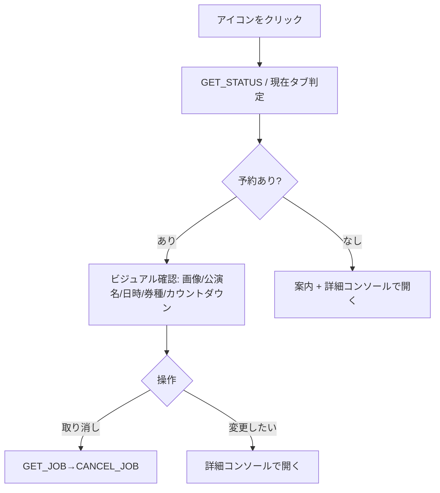

# パターン2: ポップアップ（ビジュアル確認）設計書

> 共通基盤は [reservation-entry-points-overview.md](reservation-entry-points-overview.md)、最新方針は [3-pattern-sync-redesign-design.md](3-pattern-sync-redesign-design.md)（§7・§10）が正。実装は [popup/popup.html](../popup/popup.html) / [popup/popup.js](../popup/popup.js)。
>
> **方針更新**: 当初の「ポップアップで編集・再予約」案は撤回し、ポップアップは **現在の予約をビジュアルに確認し、取り消すこと** に専念する。編集（URL・時刻・数量）と新規予約は詳細コンソール（パターン3）へ集約する。
>
> **実装確認メモ**: 現行 popup は `GET_STATUS` と現在タブ判定だけで描画し、`SAVE_JOB` は送らない。現在タブの対象判定は `isEscapeTicketPageUrl()`（パス2階層以上・URLパラメータ任意）で行う。

## 1. 目的

ツールバーのアイコンから開くポップアップで、**現在の予約状況をビジュアルに確認**し、必要なら**予約を取り消す**。公演のメインビジュアル画像・公演タイトル・実行日時(JST)・購入チケット・カウントダウンを大きく見せる。現在タブからの読み取りや編集は行わず、変更は「詳細コンソールで開く」で引き継ぐ。

## 2. 起点とスコープ

起点: ツールバーアイコン（幅360px）。

| できる | できない（詳細コンソールへ） |
| --- | --- |
| 現在の予約のビジュアル確認（画像・公演名・日時・券種・カウントダウン） | URL・実行時刻・数量の編集 |
| 予約取り消し | 新規予約の作成 |
| 詳細コンソールへの引き継ぎ | 現在タブからの読み取り／券種編集／履歴・詳細設定 |

すべての画面は共有ビューモデル `buildReservationView(job, status)`（overview / 3-pattern §3.1）から描画し、ページ内パネル・詳細コンソールと表示が一致する。

## 3. ポップアップの主モード

### A. 予約あり（ビジュアル確認）— 最頻ユース

```
┌ TicketEscape          ● STANDBY 00:11:36 ┐
│ 発売まで        00:11:36                  │  ← 既存ヒーロー（カウントダウン）
│ [ メインビジュアル画像（直接リンク）  ]   │
│ 予約中のチケット                          │
│ 公演タイトル                              │
│ 実行時刻 (JST)  6月27日22時00分           │
│ 購入チケット    一般×2  学生×1           │
│ [          予約取り消し          ]        │
│ [        詳細コンソールで開く        ]    │
└───────────────────────────────────────────┘
```

- **メインビジュアル画像**: 予約作成時（パターン1の読み取り / パターン3の `PARSE_FORM_REQUEST`）に保存した `job.heroImageUrl`（https のみ）を `referrerpolicy="no-referrer"` で直接リンク表示。取得失敗時は枠ごと非表示（§5・3-pattern §10）。
- **カウントダウン**: `STANDBY`（>60秒）/`T-MINUS`（≤60秒）/`FIRING`（0秒以降）。
- 編集はしない。変更は「詳細コンソールで開く」へ。

### B. 予約なし

- 現在タブが escape.id チケットページ → 「このページを予約できます」＋「詳細コンソールで開く」。
- そうでない → 「予約はありません」＋「詳細コンソールで開く」。

## 4. 状態モデル

| 状態 | 条件 | 表示 |
| --- | --- | --- |
| 予約あり | `view.hasReservation` | 画像・公演名・日時・券種・カウントダウン＋予約取り消し＋詳細コンソールで開く |
| `SUCCESS`/`FAILED` | 直近結果（jobは残存） | ヒーローに結果、カードに予約サマリ |
| 対象タブ・無予約 | 現在タブが escape.id チケットページ | 「このページを予約できます」＋詳細コンソールで開く |
| 空 | 上記以外 | 「予約はありません」＋詳細コンソールで開く |

## 5. メインビジュアル画像の扱い

- ポップアップは読み取りを行わないため、画像は **予約作成時に job へ保存された `heroImageUrl` をそのまま表示**する。
- 抽出は content 側で `div[class^="first"] img` → `og:image` → 最大画像 の順（3-pattern §5）。
- 拡張ページの CSP によりインライン `onerror` は使えないため、JS の `error` リスナーで枠を非表示にする（3-pattern §10）。

## 6. データとメッセージ

- 取得: `GET_STATUS`（job/status/preferences）。起動時と `storage.onChanged`（JOB/STATUS）で再描画。
- 現在タブ判定: `chrome.tabs.query({active:true,currentWindow:true})` で取得し、`isEscapeTicketPageUrl(activeTab.url)`（パス2階層以上・URLパラメータ任意）を見る。
- 予約取り消し: `GET_JOB` で **live jobId を取り直して** `CANCEL_JOB`（3-pattern §3.2）。
- 詳細コンソールで開く: 現在タブが対象チケットページなら `OPEN_OPTIONS_WITH_PAGE`（ドラフト引き継ぎ）、そうでなければ素の設定タブを開く。escape.id トップなどパス2階層未満のページはドラフトなしで開く。
- ポップアップは `SAVE_JOB` を送らない。

## 7. ユーザーフロー



## 8. アクセシビリティ

- 状態チップは `role="status" aria-live="polite"`。色だけに依存しない（ラベル併記）。
- 画像は装飾扱い（`alt=""`）。取得失敗で消えても情報は読める。
- `prefers-reduced-motion` 尊重（カウントダウンのトランジション停止）。

## 9. 受け入れ条件

1. 予約があるとき、メインビジュアル画像・公演名・実行日時(JST)・購入チケット・カウントダウンが表示される。
2. 画像取得に失敗しても、他の予約情報は表示される。
3. 「予約取り消し」で保存済み予約と alarm を解除でき、ページ内パネル／詳細コンソールにも即時反映される。
4. 予約が無いときは案内＋「詳細コンソールで開く」を表示する。
5. ポップアップでは編集・新規予約・読み取りを行わない（すべて詳細コンソールへ）。
6. 表示は `buildReservationView` 由来で、他入口と一致する。

## 10. 非ゴール

- ポップアップでの編集・新規予約・現在タブ読み取りは行わない（編集は詳細コンソールに集約）。
- 過去履歴・詳細設定はポップアップに置かない（パターン3）。
- 購入実行ロジックは変更しない。
