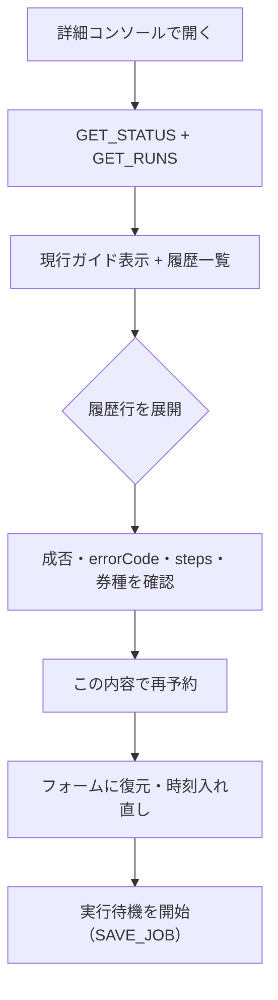

# パターン3: 詳細コンソール（設計書）

> 共通基盤は [reservation-entry-points-overview.md](reservation-entry-points-overview.md) を参照。土台は**現行のオプション画面（縦型ガイド）**＝ [options/options.html](../options/options.html) / [options/options.js](../options/options.js)。本パターンはこれを「**今の体験を残したまま**」拡張する。

## 1. 目的

3 入口のうち最も高機能な運用拠点。パターン1・2でできること（URL・時刻・券種数量・予約）に加えて、**過去の実行履歴と成否の確認**、および**詳細設定の変更**を行える。じっくり準備したいユーザーと、結果を振り返るユーザーのための画面。

「今の体験も残す」= 現行の縦型ステップ（①URL→②時刻→③券種→④実行待機）と sticky なカウントダウン/ステータスはそのまま。その**下に履歴セクションを追加**し、詳細設定（既存の折りたたみ）を編集の正式な場所とする。

## 2. スコープ（追加分）

| 既存（維持） | 追加 |
| --- | --- |
| ①URL確認 / ②時刻 / ③券種ステッパー / ④実行待機 | **実行履歴（RUNS）一覧** |
| 常時カウントダウン＋状態チップ | **各実行の成否＋原因（errorCode/detail）詳細** |
| 詳細設定の折りたたみ（間隔/並列/自動チェック） | **履歴から再予約（テンプレ流用）** |
| READOUT（現在状況の1行） | 履歴クリア |
| ページ起点ドラフトの取り込み（パターン1連携） | パターン2からのURL引き継ぎ受け口 |
| 現在jobの詳細値 | **今後の予約に使う preferences の編集** |
| 現在予約の表示 | **予約取り消し** |

## 3. 画面構成（現行＋履歴）

intro 直後（Step1 の前）に live job 直結の **「現在の予約」カード**（公演メインビジュアル・公演名・実行日時・券種・カウントダウン・予約取り消し）を置く。ウィザードのフォーム状態やページドラフトに左右されず、ここから常に取り消せる（§8）。現行の縦型ガイドの**末尾**に「実行履歴」を追加する。READOUT（現在状況）は残し、その下に履歴。

```
[sticky bar]  TicketEscape CONSOLE     ● STANDBY  00:11:36
 ┌ 現在の予約 ───────────────── ● STANDBY ┐
 │ [画像] 公演名 / 実行 2026-06-27 22:00:00 │
 │        一般×2 学生×1        00:11:36     │
 │ [ 予約取り消し ]                          │
 └───────────────────────────────────────────┘
 ① 対象URLを入力して確認      ✓
 ② 実行時刻を設定（JST）      ✓
 ③ 券種ごとに数量を設定        ✓   [− 4 +] ...
 ④ 実行待機を開始             ✓   [実行待機を開始]
 ▸ 詳細設定（通常は変更不要）        ← 間隔/並列/自動チェック（編集の正式な場所）
 READOUT  実行待機中。0秒で…
 ─────────────────────────────────────────────
 実行履歴 (RUNS)                              [履歴をクリア]
  ● SUCCESS  06/27 22:00  絶望要塞III  一般×2          ▸
  ● FAILED   06/20 12:00  ある公演      E_SUBMIT_…     ▸   ← 展開で詳細
  …
```

### 履歴行（折りたたみ）
- 左: 状態ドット＋`SUCCESS`/`FAILED`（緑/赤・mono）。
- 中: 実行時刻（JST）・公演名・主要券種サマリ。
- 右: 展開トグル。
- 展開時: `errorCode` / `errorDetail`、ステップ・タイムライン（content が記録する `steps`）、対象URL、券種内訳、`[この内容で再予約]`。

### 状態の色（DESIGN.md準拠）
- `SUCCESS` = `--te-ok`（緑）、`FAILED` = `--te-err`（赤）。アンバーは現役の予約（カウントダウン）に温存し、履歴では使わない。

## 4. データモデル（履歴）

新規ストレージ `te_runs_v1`（[overview §3](reservation-entry-points-overview.md)）。`EXECUTE_RESULT` 受信時に append（先頭が新しい・上限50）。`te_last_run_v1` の上書きは互換のため併用。履歴には、実行完了時点の現在jobではなく、**dispatch時点の job snapshot** を保存する。

```js
RunRecord = {
  runId, jobId, eventTitle, targetUrl,
  ticketPlans: [{ ticketLabel, targetQty }],
  triggerAtJst,
  status: "SUCCESS" | "FAILED",
  errorCode, errorDetail,
  steps: [{ at, step, detail }],   // content の runResult.steps を流用
  startedAt, finishedAt
}
```

> content script の `runExecution()` は既に `steps` と `errorCode/errorDetail` を持ち `EXECUTE_RESULT` で送っている。SW は `dispatchExecution()` 時点で `runId -> jobSnapshot` を `te_active_runs_v1` に保存し、`handleExecuteResult()` で snapshot と result を結合して `te_runs_v1` へ append する。購入実行ロジックは不変。

## 5. メッセージ

追加（[overview §4](reservation-entry-points-overview.md)）:

| メッセージ | 送信元 → 先 | 用途 |
| --- | --- | --- |
| `GET_RUNS` | options → SW | `te_runs_v1` を取得して履歴描画 |
| `CLEAR_RUNS` | options → SW | 履歴クリア |
| `GET_PREFERENCES` | options → SW | 詳細設定の既定値を取得 |
| `SAVE_PREFERENCES` | options → SW | 詳細設定の既定値を保存 |
| `GET_PAGE_DRAFT` / `CLEAR_PAGE_DRAFT` | options ↔ SW | パターン1のページ起点ドラフト取り込み |

既存 `handleExecuteResult()` 拡張（疑似コード）:

```js
async function handleExecuteResult(result) {
  await setStorageValue(LAST_RUN, result);            // 既存（互換）
  const snapshot = await consumeActiveRun(result.runId);
  await appendRun(toRunRecord(result, snapshot));      // 追加: te_runs_v1 へ
  await setStatus({ state: result.status, ... });     // 既存
}
```

## 6. 詳細設定の変更

既存の折りたたみ「詳細設定」を正式な編集場所とする（パターン1・2では出さない項目）。ここで変更した値は `te_preferences_v1` として保存し、今後の新規予約すべてに使う。

| 項目 | 範囲 | 既定 |
| --- | --- | --- |
| クリック間隔 (ms) | 5–500 | 30 |
| 並列実行数 | 1–5 | 1 |
| フォーム内チェックボックス自動ON | on/off | on |
| （将来）セレクタ上書き `formRoot`/`submitButton` | 文字列 | なし |

`selectorOverrides` は SW の `sanitizeJob()` が既に受け付ける。上級者向けに「サイト構造が変わった時の手動指定」をここに置ける（任意・段階実装）。

保存優先順位:

1. 既存jobを編集して再保存する場合は job の値
2. 新規予約は `te_preferences_v1`
3. preferences がなければ `DEFAULT_JOB`

詳細設定を変更したら、現在フォームのjobにも反映し、同時に preferences として保存する。

## 7. 履歴から再予約（テンプレ流用）

履歴行の `[この内容で再予約]` で、その RunRecord の `targetUrl`/`eventTitle`/`ticketPlans` をフォームへ復元。時刻だけ未来へ入れ直して `実行待機を開始`。同じ公演の別便・リトライを高速化する。

## 8. 入口の統合（1・2との接続）

- パターン1・2の「詳細コンソールで開く」から遷移してくる受け口。起動時に `GET_PAGE_DRAFT` を見て、あれば Step1 のURLを自動入力し、`情報を読み取る` を amber 強調（先行 doc 準拠）。なお「現在の予約」カード（live job 直結・予約取り消し）はドラフトに依存せず常時機能する（[3-pattern-sync-redesign-design.md](3-pattern-sync-redesign-design.md) §8.1）。
- 読み取りは `PARSE_FORM_REQUEST`（URLから読み取り）を使う。現在タブからの直接読み取りは廃止する。

## 9. ユーザーフロー（履歴確認・再予約）



## 10. エラー・エッジ

| ケース | 表示 |
| --- | --- |
| 履歴なし | 「まだ実行履歴はありません。」 |
| 失敗行 | `errorCode` をユーザー語に翻訳（例: `E_SUBMIT_NOT_APPLIED` → 「カート投入が反映されませんでした」）＋ 原文は詳細に格納 |
| 履歴肥大 | 上限50で古いものから自動破棄。`履歴をクリア`も提供 |
| 再予約で時刻が過去 | 既存の時刻バリデーション（過去は弾く） |

## 11. アクセシビリティ

- 履歴は順序付きリスト。各行は展開可能（`aria-expanded`）。状態は色＋ラベル（SUCCESS/FAILED テキスト）。
- 履歴クリアは破壊的操作のため確認を挟む（DESIGN.md: 赤は不可逆のみ）。

## 12. 受け入れ条件

1. 現行の縦型ガイド（①〜④）とカウントダウンは従来どおり動く（体験を壊さない）。
2. 実行のたびに `te_runs_v1` に履歴が追加され、画面の「実行履歴」に成否付きで並ぶ。
3. 履歴行を展開すると `errorCode`/`errorDetail`・ステップ・券種・URLが確認できる。
4. 「この内容で再予約」で過去の設定をフォームに復元し、時刻を入れ直して予約できる。
5. 詳細設定（間隔/並列/自動チェック）を変更して予約に反映でき、preferences として次回以降の新規予約にも使われる。
6. 数量が1枚以上あり、実行時刻が確認済みの場合のみ予約保存できる。
7. 別URLの予約を置き換える場合、明示確認なしではSWが拒否する。
8. 「予約取り消し」で保存済み予約と alarm を解除でき、ページ内パネル/ポップアップにも反映される。
9. パターン1/2からの遷移時、URLが引き継がれ「情報を読み取る」が強調される。

## 13. 段階実装

- Phase 1: SW `handleExecuteResult()` に job snapshot 付き `te_runs_v1` append を追加。`GET_RUNS`/`CLEAR_RUNS` を追加。
- Phase 2: `te_preferences_v1` と `GET_PREFERENCES`/`SAVE_PREFERENCES` を追加し、詳細設定へ反映。
- Phase 3: options に「実行履歴」セクション（行リスト＋展開詳細）を追加。
- Phase 4: 「この内容で再予約」（テンプレ復元）。
- Phase 5: パターン1ドラフト取り込み・（任意）`selectorOverrides` 編集UI。

## 14. 非ゴール

- アクティブ予約の複数同時保持はしない（単一 `te_job_v1`＋履歴で運用。複数化は別設計）。
- 購入実行ロジック（`applyTicketPlan`/`submitCart`）は変更しない。
- 履歴からワンクリックで即時実行（`EXECUTE_NOW`）は既定で出さない（誤操作防止。必要なら明示）。
