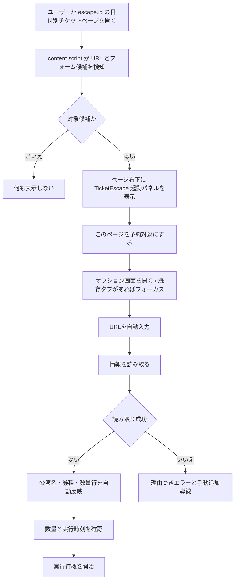

# Ticket Page Entry UX Design

> **先行案・背景資料**: 本書は初期のUX案。**現在の正式方針は3パターン設計**（[reservation-entry-points-overview.md](reservation-entry-points-overview.md)・[pattern-1-in-page-reservation-design.md](pattern-1-in-page-reservation-design.md)・[3-pattern-sync-redesign-design.md](3-pattern-sync-redesign-design.md)）。矛盾する場合はそちらが正。特に表示ゲート（escape.id 配下なら常時表示）と状態モデル（ARMED / OTHER_RESERVED / READY / LAUNCHER）は本書より新方針が優先。
>
> **現行実装との差分**: パターン1は「起動パネルからオプション画面へ」ではなく、ページ内パネルだけで読み取り・数量設定・予約まで完結する。詳細コンソールの読み取りは `PAGE_DRAFT.tabId` を使った元タブ直送ではなく、SW の `PARSE_FORM_REQUEST`（URL読み取り）経路を使う。既存予約がある状態で詳細コンソールを開いた場合、ドラフトは破棄されライブ予約が優先される。詳細は [current-implementation-review.md](current-implementation-review.md)。

## 目的

`escape.id` の特定日付のチケットページを開いた瞬間に、TicketEscape が「このページを予約対象にできる」と明確に知らせる体験へ変える。

現状は、ユーザーがオプション画面を開き、対象URLを貼り付け、`確認` ボタンで券種を取得する「設定画面起点」の流れになっている。新しい体験では、ユーザーが実際のチケットページを開いた行動を起点にして、拡張機能がそのページを検知し、予約設定へ自然につなげる。

対象イメージ:

```text
https://escape.id/{任意}/{任意}/?
```

この設計では、既存の `確認（公演・券種を取得）` は機能として残し、ユーザー向けには `情報を読み取る` に言い換える。押下すると、ページ上の公演名・券種・現在数量を読み取り、チケット数量設定へ自動反映する。

## 体験方針

1. ユーザーはまず `escape.id` の購入ページへ行く。
2. TicketEscape が対象候補ページを検知する。
3. ページ上に小さな起動パネルを出し、「このページを予約対象にする」導線を見せる。
4. 予約設定画面が開き、URLは自動入力済みになる。
5. ユーザーが `情報を読み取る` を押す。
6. 公演名と券種が自動反映される。
7. ユーザーは数量と実行時刻だけ確認して `実行待機を開始` する。

重要なのは、「URLをコピーして貼る」作業を主導線から外すこと。URL入力欄は残すが、通常ユーザーは触らなくてよい状態にする。

## 現状との差分

| 項目 | 現状 | 新UX |
| --- | --- | --- |
| 開始地点 | オプション画面 | 実際のチケットページ |
| URL指定 | 手入力・貼り付け | 現在ページから自動取得 |
| 券種取得 | `確認` ボタン | `情報を読み取る` ボタン |
| 拡張機能の存在感 | ユーザーが自分で開く | 対象ページ上で起動パネルを出す |
| 主要コピー | 対象URLを入力して確認 | このページを予約対象にする |
| 認知負荷 | 手順を覚える必要がある | ページ上の導線に従う |

## 対象ページの判定

まずは過剰に広げず、次の条件を満たすページを「候補」とする。

```text
protocol: https
hostname: escape.id
pathname: 2セグメント以上
```

例:

```text
https://escape.id/foo/bar/
https://escape.id/foo/bar/?
https://escape.id/foo/bar/?date=...
```

ただし URL だけでは誤検知があり得るため、表示レベルを2段階に分ける。

| レベル | 条件 | UI |
| --- | --- | --- |
| URL候補 | `https://escape.id/*/*` に見える | 小さな待機バッジを表示 |
| フォーム候補 | 既存の `waitForTicketRows` でフォームまたは券種候補を検出 | 起動パネルを展開 |
| 非対象 | URL不一致、ログインページ、決済後ページなど | 何も表示しない |

フォーム検出は既存の `content/content_script.js` の探索ロジックを流用する。最初から完璧なURLパターンに頼らず、「URLで候補化し、DOMで確度を上げる」設計にする。

## 画面設計

### 1. ページ上の起動パネル

`escape.id` の対象候補ページ右下に、固定配置の小さなパネルを表示する。Chrome の拡張ポップアップはページ側から自動で開けないため、「立ち上がる」体験は content script が注入するページ内パネルで実現する。

表示位置:

```text
desktop: 右下 fixed, width 320-360px
mobile narrow: 下部 fixed, left/right 12px
```

初回表示:

```text
TicketEscape
このページを予約対象にできます

[このページを予約対象にする]
[閉じる]
```

既に同じURLで実行待機中の場合:

```text
TicketEscape
このページは実行待機中です

発売まで 00:12:34
[詳細コンソールで開く]
```

別URLのジョブが保存済みの場合:

```text
TicketEscape
別のページが予約対象です

保存中: escape.id/...
[このページに切り替える]
[詳細コンソールで開く]
```

フォーム未検出の場合:

```text
TicketEscape
チケット情報を探しています

ページの読み込み完了後に表示します
```

この状態は長く見せない。数秒経っても見つからない場合はバッジへ縮小する。

### 2. オプション画面の新しい主導線

オプション画面は既存の縦型ステップを活かす。ただし Step 1 の見せ方を変える。

変更前:

```text
対象URLを入力して確認
[URL入力]
[確認（公演・券種を取得）]
```

変更後:

```text
予約対象ページ
[URL入力済み]
[情報を読み取る]
```

補足コピー:

```text
このページから公演名と券種を読み取ります。取得後、数量設定に自動反映されます。
```

ページ起点で開いた場合は、URL欄に現在ページのURLを自動入力し、`情報を読み取る` ボタンを主アクションとして amber で強調する。

手入力ユーザー向けの機能は残す。URL欄を編集した場合だけ `情報を読み取る` を再度促す。

### 3. 読み取り成功後

読み取り成功時は、既存の `eventReadout` と `planRows` を更新する。

表示:

```text
公演情報を読み取りました
{公演名}

券種を 3 件取得しました。数量を設定してください。
```

チケット数量設定:

```text
一般チケット        [-] 0 [+]
学生チケット        [-] 0 [+]
グループチケット    [-] 0 [+]
```

初期数量はページ上の現在数量を反映する。ページ上で全て 0 の場合は全て 0 のままにし、`実行待機を開始` は amber パルスで「数量を設定してください」と促す。勝手に 1 枚へ変更しない。

### 4. 読み取り失敗時

エラーは原因別に短く出す。

| ケース | 表示文 |
| --- | --- |
| フォームが見つからない | チケットフォームが見つかりません。購入ページを開いてから再試行してください。 |
| 券種が空 | フォームは見つかりましたが、券種を読み取れませんでした。ページの読み込み後に再試行してください。 |
| ログインが必要そう | チケット情報を読み取れません。escape.id にログインしてから再試行してください。 |
| DOM変更の可能性 | サイト構造が変わった可能性があります。手動で券種を追加してください。 |

失敗時も URL は消さない。ユーザーが手動で券種を追加できる逃げ道を残す。

## 推奨ユーザーフロー



## 実装設計

### 既存処理の再利用

現在の `確認` は次の経路で動いている。

```text
options/options.js
  parseForm()
    -> MESSAGE_TYPES.PARSE_FORM_REQUEST

background/service_worker.js
  handleParseForm(url)
    -> 対象URLを新規タブで開く
    -> content script へ PARSE_FORM_REQUEST

content/content_script.js
  handleParseFormRequest()
    -> waitForTicketRows()
    -> tickets / eventTitle を返す
```

新UXでも、券種抽出の本体は `handleParseFormRequest()` と `waitForTicketRows()` を使う。差分は「どのページを読むか」と「どこから起動するか」。

### 新しく追加する責務

| ファイル | 追加責務 |
| --- | --- |
| `content/content_script.js` | 対象ページ検知、ページ内起動パネル表示、現在ページの読み取り |
| `background/service_worker.js` | ページ起点のドラフト保存、オプション画面を開く、既存タブの再利用 |
| `options/options.js` | ドラフトからURLを復元、`情報を読み取る` ボタンとして表示、source tab があればそのタブを優先して読む |
| `lib/shared.js` | メッセージ種別とストレージキー追加 |
| `options/options.html` | Step 1 の文言変更、ページ起点状態の表示 |

### 追加するストレージ

```js
PAGE_DRAFT: "te_page_draft_v1"
```

保存する値:

```js
{
  url: "https://escape.id/...",
  normalizedUrl: "https://escape.id/.../?...",
  tabId: 123,
  title: "ページタイトル",
  eventTitle: "取得できた場合のみ",
  detectedAt: 1710000000000,
  source: "content-launcher"
}
```

ドラフトは一時情報として扱う。ジョブ保存 `te_job_v1` とは分ける。`実行待機を開始` が成功した時点でジョブが正となり、ドラフトは消してよい。

### 追加するメッセージ

```js
OPEN_OPTIONS_WITH_PAGE: "TE_OPEN_OPTIONS_WITH_PAGE"
GET_PAGE_DRAFT: "TE_GET_PAGE_DRAFT"
CLEAR_PAGE_DRAFT: "TE_CLEAR_PAGE_DRAFT"
```

役割:

| メッセージ | 送信元 | 送信先 | 内容 |
| --- | --- | --- | --- |
| `OPEN_OPTIONS_WITH_PAGE` | content | background | 現在ページをドラフト保存して設定画面を開く |
| `GET_PAGE_DRAFT` | options | background | 起動時にドラフトを取得する |
| `CLEAR_PAGE_DRAFT` | options | background | ジョブ保存後やURL手動変更時にドラフトを破棄する |
現在タブからの直接読み取りは、ページ内パネルでは content script 内の直接呼び出しとして実装されている。詳細コンソールでは `PARSE_FORM_REQUEST` でURLから読み取る。

### タブ再利用の方針（旧案）

ページ起点で開いた直後に `情報を読み取る` を押した場合、すでにそのページは開いている。新規タブを増やすより、元タブへ `PARSE_FORM_REQUEST` を送るほうが自然。

優先順位:

1. `PAGE_DRAFT.tabId` が存在し、同じ URL を開いているタブへ直接メッセージ送信
2. 同じ normalized URL の既存 `escape.id` タブを検索して送信
3. 見つからなければ現行どおり URL を新規タブで開いて読み取り

これにより、ユーザーが見ているページと設定画面の内容がずれにくくなる。

> 現行実装ではこの優先順位は未採用。`PAGE_DRAFT.tabId` は保存されるが、詳細コンソールの `parseForm()` は URL だけを SW に渡し、SW が対象 URL のタブを開いて読み取る。

## UI状態モデル

### ページ内起動パネル

| 状態 | 条件 | 表示 | 主ボタン |
| --- | --- | --- | --- |
| `SCANNING` | URL候補、DOM確認中 | チケット情報を探しています | なし |
| `READY` | フォーム候補を検出 | このページを予約対象にできます | このページを予約対象にする |
| `SAME_JOB` | 保存済みジョブURLと一致 | このページは実行待機中です | 詳細コンソールで開く |
| `OTHER_JOB` | 別URLジョブあり | 別のページが予約対象です | このページに切り替える |
| `UNSUPPORTED` | URL候補だがフォームなし | 必要時だけ縮小バッジ | 詳細コンソールで開く |
| `DISMISSED` | ユーザーが閉じた | 小さなバッジのみ | 再表示 |

`DISMISSED` はタブ単位でよい。永続保存すると、次回の本番ページで気づけないリスクがある。

> 現行の正式状態名は [pattern-1-in-page-reservation-design.md](pattern-1-in-page-reservation-design.md) の `ARMED` / `OTHER_RESERVED` / `OTHER_RESERVED_VIEW` / `READY` / `FORM` / `LAUNCHER`。また、日付選択などのURL/フォーム変化は polling と `popstate` / `hashchange` で追従する。

### オプション画面

| 状態 | 条件 | UI |
| --- | --- | --- |
| `EMPTY` | ジョブもドラフトもなし | 従来の手入力導線 |
| `PAGE_DRAFT` | ページ起点で開いた | URL入力済み、`情報を読み取る` を強調 |
| `READING` | 読み取り中 | ボタン無効化、readout に進行表示 |
| `READ_SUCCESS` | 券種取得成功 | 公演名と券種行を反映 |
| `READ_FAILED` | 取得失敗 | 原因表示、手動追加を残す |
| `ARMED` | 保存成功 | 既存のカウントダウン状態 |

## コピー仕様

### ページ内起動パネル

タイトル:

```text
TicketEscape
```

本文:

```text
このページを予約対象にできます
```

主ボタン:

```text
このページを予約対象にする
```

閉じる:

```text
閉じる
```

### オプション画面 Step 1

見出し:

```text
予約対象ページ
```

ヘルプ:

```text
このページから公演名と券種を読み取ります。取得後、数量設定に自動反映されます。
```

ボタン:

```text
情報を読み取る
```

成功:

```text
券種を {n} 件取得しました。数量を設定してください。
```

失敗:

```text
読み取り失敗: {reason}
```

## ビジュアル仕様

既存の `DESIGN.md` / `styles/tokens.css` の CONSOLE 方針に合わせる。

ページ内起動パネル:

- 背景: `--te-surface`
- 枠線: `--te-line`
- 主ボタン: `--te-signal-fill`
- 成功・待機中: 既存の status chip と同じ amber / green を使う
- 角丸: `--te-r-lg`
- 影: 最小限。ページ上で浮かせる必要があるため `--te-shadow-menu` のみ許可
- アイコン: 絵文字禁止。既存と同じ単線SVG、または将来 lucide 系へ統一

注意点:

- チケット購入フォームのボタンや数量UIを覆わない。
- 右下配置でフォームと重なる場合は、ユーザーがドラッグせずとも閉じられるようにする。
- `z-index` は高くするが、モーダルのようにページ全体を塞がない。
- `prefers-reduced-motion` ではパルスを止める。

## アクセシビリティ

- 起動パネルは `role="region"` とし、ラベルを `TicketEscape` にする。
- 自動表示時にフォーカスを奪わない。
- 主ボタンには通常の Tab 移動で到達できる。
- 閉じるボタンを必ず置く。
- 状態テキストは色だけに依存しない。
- 読み取り中は `aria-busy="true"` を付ける。
- 読み取り成功・失敗は `aria-live="polite"` の readout に表示する。

## 段階的な実装順

### Phase 1: 文言とドラフト起動

- `確認（公演・券種を取得）` を `情報を読み取る` に変更する。
- Step 1 見出しを `予約対象ページ` に変更する。
- `PAGE_DRAFT` ストレージと `GET_PAGE_DRAFT` を追加する。
- オプション画面起動時にドラフトURLを自動入力する。

この段階では、読み取り処理は現行どおり URL から新規タブを開く方式でよい。

### Phase 2: ページ内起動パネル

- content script で対象URL候補を検知する。
- フォーム候補が見つかったら起動パネルを表示する。
- `このページを予約対象にする` 押下で `OPEN_OPTIONS_WITH_PAGE` を送る。
- background がドラフト保存後、既存オプションタブをフォーカスまたは新規作成する。

### Phase 3: 元タブからの直接読み取り（未採用案）

- `PAGE_DRAFT.tabId` を使って、元タブへ `PARSE_FORM_REQUEST` を送る。
- URLが変わっていた場合は既存の URL 読み取りへフォールバックする。
- 読み取り結果を現行 `parseForm()` と同じ経路で `eventTitle` / `planRows` へ反映する。

現行実装では、ページ内パネルは自分のページで直接読み取り、詳細コンソールは SW の URL 読み取り経路を使う。

### Phase 4: 保存済みジョブとの同期

- 起動パネルで、現在ページが保存済みジョブと同じか判定する。
- 同じ場合は `実行待機中` 表示とカウントダウンを出す。
- 別ページの場合は `このページに切り替える` 導線を出す。

## 受け入れ条件

1. `https://escape.id/{任意}/{任意}/?` にアクセスすると、対象候補ページで TicketEscape の起動パネルが表示される。
2. 起動パネルの `このページを予約対象にする` を押すと、オプション画面が開き、対象URLが自動入力される。
3. オプション画面の Step 1 では `確認` ではなく `情報を読み取る` と表示される。
4. `情報を読み取る` を押すと、既存の確認処理と同等に公演名・券種・現在数量が反映される。
5. 読み取り成功後、ユーザーは数量と時刻を設定して `実行待機を開始` できる。
6. 既に同じURLで待機中の場合、ページ内パネルは新規設定ではなく `実行待機中` と表示する。
7. 対象外ページ、ログインページ、決済後ページでは邪魔なパネルを出さない。
8. パネルを閉じても、拡張アイコンまたは小さなバッジから再表示できる。

## リスクと対策

| リスク | 対策 |
| --- | --- |
| URLだけでは対象ページを誤判定する | URL候補 + DOMフォーム検出の2段階にする |
| ページ内パネルが購入UIを邪魔する | 右下固定、閉じるボタン、縮小バッジを用意する |
| Chrome拡張ポップアップを自動で開けない | content script のページ内パネルで起動体験を作る |
| 元タブが閉じられる | 同URLタブ検索、なければ既存の新規タブ読み取りにフォールバック |
| サイトDOM変更で券種取得に失敗する | 既存の手動券種追加を残し、エラー文を原因別にする |
| 保存済みジョブと新しいページが競合する | `別のページが予約対象です` と表示し、切り替え操作を明示する |

## 非ゴール

- ページ訪問だけで自動的に購入・カート投入はしない。
- ユーザー確認なしに保存済みジョブを上書きしない。
- ログインや決済操作の自動化は追加しない。
- 対象外ドメインへの対応はしない。

## 実装メモ

最小実装では、まず `options/options.html` と `options/options.js` の文言を変え、ドラフトURLを受け取れるようにするだけでも体験が改善する。その後に content script の起動パネルを追加する。

既存実装の強みは、券種読み取りと自動実行の中核がすでに分離されていること。今回のUX刷新は、主に「入口」を作り直す変更であり、`applyTicketPlan()` や `submitCart()` の購入実行ロジックには触れない方針が安全。
